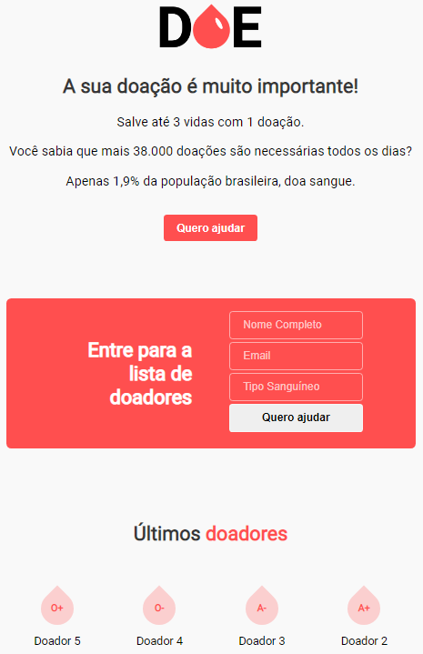

## Doe Sangue | Maratona Dev #3

Web project developed at the event [Maratona Dev #3 - Rocketseat](https://rocketseat.com.br/) to encourage, find and register blood donors.

<h1 align="center">
  
</h1>

## 📌 Index
- ⚙ [Settings](#-settings)
- 💻 [Technologies](#-technologies)
- 🚀 [How to run](#-how-to-run)
---

## ⚙ Settings
  Install the [PostgreSQL](https://www.postgresql.org/) and create database 'doe' and table 'donors' with columns 'id', 'name', 'email' and 'blood' (or open the script in the   paste docs).
  
---

## 💻 Technologies
    - Node.js
    - Html
    - Css
    - Nodemon
    - Nunjucks
    - Express
    - PostgreSQL
---

## 🚀 How to run

  > Cloning the repository
  ```bash
    # Cloning repository
    git clone https://github.com/antoniosergiojr/maratonaDev3_doeSangue.git
  ```

  > Running web project
  ```bash
    # Accessing web project
    cd maratonaDev_doeSangue
    
    # Install dependencies
    npm i

    # Running web project
    npm start
  ```
---
